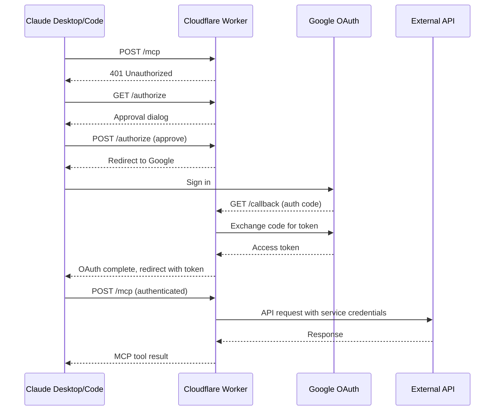

# cf-mcp

Scaffold and deploy custom MCP servers on Cloudflare Workers with Google OAuth.

## Quick start

Install the plugin in Claude Code:

    /plugin install cf-mcp@adamlevoy-plugins

Then ask Claude:

> "Create a Cloudflare Workers MCP server for the Stripe API"

The skill triggers when Cloudflare Workers is explicitly mentioned in the context of building an MCP server.

## Why this architecture

Claude Desktop, Claude.ai, and Claude Code all support remote MCP servers. Unlike local MCP servers that require each user to install dependencies and manage processes on their machine, a remote MCP server runs on Cloudflare Workers — your team members just authenticate and go. No local setup, no `npx`, no Docker containers.

This architecture is designed for teams:

- **One deploy, entire org has access** — an admin deploys the MCP server to Cloudflare Workers and adds the connector URL to the organization's Claude settings. Every team member sees it automatically — they just click Connect and sign in with Google.
- **Secure by default** — Google OAuth gates access. Restrict to a Google Workspace domain so only your organization can authenticate. API keys live in Cloudflare secrets, never on client machines.
- **Always available** — runs on Cloudflare's edge network. No servers to maintain, no uptime to monitor. Each authenticated session gets its own Durable Object instance.
- **Standard MCP protocol** — works with Claude Desktop, Claude Code, and any MCP-compatible client. The OAuth 2.1 flow is handled automatically by the client.

## Team distribution

### Admin setup (one time)

1. Deploy the MCP server to Cloudflare Workers (this skill handles the full process)
2. Add the connector to your organization via **Settings** → **Connectors** → **Add Custom Connector** (in Claude Desktop or Claude.ai):
   - URL: `https://<service>-mcp.<your-domain>/mcp`
3. The connector is now available to all organization members across Claude Desktop, Claude.ai, and Claude Code

### Team member experience — Claude Desktop

1. Open **Claude Desktop** — the connector appears under available integrations
2. Click **Connect** — a browser window opens with an approval dialog
3. Click **Approve** — redirected to Google sign-in
4. Sign in with your organization Google account — done

### Team member experience — Claude Code

Org-level connectors are automatically available to Claude Code users logged into the same organization.

To add a connector individually in the terminal:

    claude mcp add --transport http <service>-mcp https://<service>-mcp.<your-domain>/mcp

Then authenticate by running `/mcp` inside Claude Code, which opens the browser OAuth flow.

### Authentication

The OAuth token is stored by the client and refreshed automatically. Team members only authenticate once. No API keys, no configuration files, no terminal commands.

## How it works

Every remote MCP server on Cloudflare Workers needs the same boilerplate: an OAuthProvider entrypoint, a Durable Object-backed McpAgent, Google OAuth handlers, CSRF/state utilities, and wrangler config. That's ~900 lines before you write a single tool.

This skill codifies that pattern into a set of templates. When you ask Claude to create a new Cloudflare Workers MCP, it copies the templates into a fresh project, replaces placeholders with your service-specific values, and walks you through implementing tools, configuring secrets, and deploying — end to end.

No CLI tool or generator script. Claude reads the templates directly, does find-and-replace on `{{PLACEHOLDERS}}`, and writes the files. This keeps things simple and flexible — you can customize anything during scaffolding.

## Architecture

**OAuthProvider** (`@cloudflare/workers-oauth-provider`) is the Worker entrypoint. It handles OAuth 2.1 token management and gates access to the MCP endpoint.

**GoogleHandler** (Hono) manages the three OAuth routes: `GET /authorize` shows an approval dialog, `POST /authorize` processes consent and redirects to Google, `GET /callback` exchanges the auth code for a token and completes the flow. Optionally restricts access to a Google Workspace domain via the `hd` parameter.

**McpAgent** (Durable Object) is where your tools live. Each authenticated session gets its own DO instance. Tools are registered in `init()` using `this.server.registerTool()` with Zod schemas, structured logging, and response truncation.

**API Client** is a typed HTTP client for the target service. The scaffold includes error handling with status-specific messages, auth header injection, and a `truncateResponse()` helper that caps output at 25k characters.

## Stack

| Layer | Technology |
|-------|-----------|
| Runtime | Cloudflare Workers + Durable Objects |
| Auth | `@cloudflare/workers-oauth-provider` + Google OAuth 2.0 |
| MCP | `@modelcontextprotocol/sdk` + `agents` (McpAgent) |
| OAuth routes | Hono |
| Validation | Zod |
| State storage | Workers KV (OAuth state/CSRF tokens) |

## Template files

The `templates/` directory contains everything needed for a working project:

| File | Description |
|------|-------------|
| `src/index.ts.tmpl` | McpAgent scaffold — Env interface, API client class, truncation helper, example tool, OAuthProvider entrypoint |
| `src/google-handler.ts` | Google OAuth handler — authorize, consent, callback routes via Hono |
| `src/workers-oauth-utils.ts` | CSRF protection, state management, session binding, approval dialog HTML (656 lines, used as-is) |
| `src/utils.ts.tmpl` | Google OAuth helpers — authorize URL builder, token exchange, user info types |
| `wrangler.toml.tmpl` | Worker config — DO bindings, KV namespace, custom domain route |
| `package.json.tmpl` | Dependencies pinned to compatible versions |
| `tsconfig.json` | TypeScript config — ES2022, Bundler module resolution |
| `CLAUDE.md.tmpl` | Project documentation — commands, secrets, architecture, tool list |

Files ending in `.tmpl` contain `{{PLACEHOLDER}}` tokens that get replaced during scaffolding. Files without `.tmpl` are copied as-is.

## Workflow

The skill guides Claude through 4 phases:

1. **Project Setup** — gather parameters (service name, domain, account ID), create project directory, copy and process templates, install dependencies
2. **Implement Tools** — research the target API, update the Env interface and API client, register tools with Zod schemas and annotations
3. **Configure & Deploy** — create KV namespace, set secrets, configure Google Cloud Console OAuth, deploy to Cloudflare
4. **Connect & Test** — add the MCP connector URL to your org, complete OAuth flow, verify each tool works
